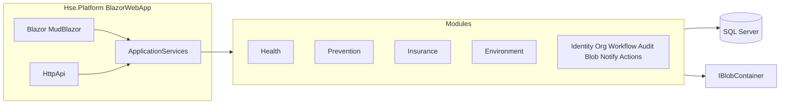

# Executive Architecture Overview

## Vision

HSE Management Platform یک نرم‌افزار سازمانی برای ثبت، پایش، تأیید و گزارش فرآیندهای بهداشت شغلی، پیشگیری و ایمنی، بیمه، و محیط زیست است.

سیستم باید:

- برای سال‌ها قابل توسعه بماند
- ماژول‌های جدید را بدون فروپاشی هسته بپذیرد
- دادهٔ حساس پزشکی را با دسترسی دقیق محافظت کند
- Audit کامل داشته باشد
- تست‌پذیر و قابل نگهداری باشد
- در آینده بتواند بخشی از خود را به Microservice تبدیل کند — بدون بازنویسی دامنه

هدف نهایی:

```text
Simple + Modular + Secure + Testable + Maintainable + Extensible + Enterprise Ready
```

CRUD First, Architecture Later ممنوع است. Overengineering نیز ممنوع است. هر abstraction باید دلیل معماری مشخص داشته باشد.

## سبک معماری

**Modular Monolith + DDD طبق استاندارد ABP Framework 10 + Vertical Slice داخل لایهٔ Application هر ماژول.**

یک واحد استقرار در نسخه اول (قالب ABP Blazor Web App غیر tiered). مرز ماژول‌ها با Application.Contracts و Architecture Tests محافظت می‌شود.



UI و API هر دو فقط Application Service / DTO می‌بینند. UI هرگز به EF Core، Entity دیتابیس، یا Aggregate به‌صورت مستقیم دسترسی ندارد. MediatR استاندارد این Solution نیست.

## تعادل ضد Overengineering

| انجام می‌شود | انجام نمی‌شود در v1 |
| --- | --- |
| مرز ماژول ABP + Application.Contracts + Architecture Tests | Message bus / Kafka |
| DbContext جدا per module | Database per module |
| ABP Local/Distributed Event Bus in-process | Outbox broker پیچیده |
| State machine قابل‌پیکربندی | Elsa / BPMN (ABP Commercial) |
| `IBlobContainer` + File System | Azure Blob / S3 از روز اول |
| ABP Background Jobs + Hangfire | Orchestrator جدا |
| Permission سیستم ABP | موتور Authorization موازی |
| ABP Tenant + data filter | Multi-tenant عملیاتی کامل |
| Localization `fa`/`en` + تقویم وابسته به فرهنگ | دو مدل تاریخ در DB |
| رمزنگاری PHI با `IStringEncryptionService` | PHI plaintext در SQL |

## تصمیم‌های پایه تأییدشده

| موضوع | تصمیم | ADR |
| --- | --- | --- |
| سبک سیستم | Modular Monolith | [ADR-001](../adr/ADR-001-modular-monolith.md) |
| دیتابیس | یک SQL Server، Schema per module | [ADR-002](../adr/ADR-002-database-strategy.md) |
| هویت | ABP Identity محلی | [ADR-003](../adr/ADR-003-authentication.md) |
| چندمستأجری | ABP Tenant + data filter | [ADR-004](../adr/ADR-004-multi-tenancy.md) |
| فایل | ABP Blob + File System | [ADR-005](../adr/ADR-005-file-storage.md) |
| Workflow | Configurable state machine | [ADR-006](../adr/ADR-006-workflow-engine.md) |
| UI | MudBlazor در ABP + RTL برای fa | [ADR-007](../adr/ADR-007-ui-library.md) |
| Blazor | Web App / Interactive Server | [ADR-008](../adr/ADR-008-blazor-rendering.md) |
| Job | ABP + Hangfire | [ADR-009](../adr/ADR-009-background-jobs.md) |
| PK | ABP sequential Guid | [ADR-010](../adr/ADR-010-primary-key-strategy.md) |
| پروژه ماژول | لایه‌های استاندارد ABP | [ADR-018](../adr/ADR-018-abp-framework.md) |
| ارتباط ماژول | ABP Event Bus | [ADR-012](../adr/ADR-012-cross-module-communication.md) |
| گزارش | جدا از write model | [ADR-013](../adr/ADR-013-reporting.md) |
| PHI | Permission + mask + read-audit + encryption | [ADR-014](../adr/ADR-014-phi-protection.md) |
| Host | ABP app غیر tiered | [ADR-015](../adr/ADR-015-host-composition.md) |
| زبان و تقویم | fa شمسی / en میلادی | [ADR-016](../adr/ADR-016-localization-and-calendar.md) |
| رمزنگاری | IStringEncryptionService | [ADR-017](../adr/ADR-017-encryption.md) |
| استاندارد تولید | ABP Framework 10 OSS | [ADR-018](../adr/ADR-018-abp-framework.md) |
| استقرار | Private Cloud / Docker | [deployment/strategy.md](../deployment/strategy.md) |

## اصل توسعه

پروژه Big Bang ساخته نمی‌شود. روش:

**Vertical Slice + Incremental Development**

هر Feature از Database تا UI و Test کامل می‌شود. Definition of Done در [development/definition-of-done.md](../development/definition-of-done.md).

## وضعیت فاز

| فاز | محتوا | وضعیت |
| --- | --- | --- |
| 0 Discovery | Requirements, Assumptions, Risks, Questions | انجام‌شده در همین docs |
| 1 Architecture | این مستندات | انجام‌شده |
| 2 Foundation | Solution ABP، Identity، Localization، Encryption، Blob، Hangfire | انجام‌شده — `Hse.Platform/` |
| 3 First Slice | Health → Medical Examination | پس از تأیید صریح |
| 4+ | Featureهای بعدی یکی‌یکی | پس از Slice اول |
