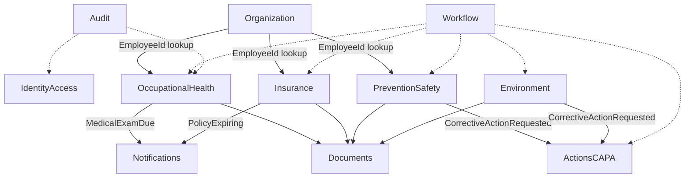

# Bounded Context Map

## Contexts

| Context | ماژول | نوع |
| --- | --- | --- |
| Identity & Access | Identity | Platform |
| Organization | Organization | Platform |
| Occupational Health | Health | Business |
| Prevention & Safety | Prevention | Business |
| Insurance | Insurance | Business |
| Environment | Environment | Business |
| Actions (CAPA) | Actions | Platform |
| Documents | Documents | Platform |
| Workflow | Workflow | Platform |
| Audit | Audit | Platform |
| Notifications | Notifications | Platform |
| Reporting | بعداً `rpt` / ماژول Reporting | Read side |

## Map

## قوانین نقشه

- **Organization مالک Employee است.** Health کپی پرسنلی ندارد.
- **Workflow generic است**؛ هر Aggregate که فرآیند دارد Instance می‌سازد، نه موتور جدا.
- **Documents مالک باینری و متادیتا است**؛ ماژول کسب‌وکار فقط `FileId` / link دارد.
- **Audit شنوندهٔ زیرساخت + صریح Use Case است**؛ Bounded Context کسب‌وکار نیست که دیگران به Domain آن وابسته شوند.
- **Reporting روی نقشهٔ write نیست.**

## Shared Kernel

حداقل:

- شناسه‌ها: Guid متوالی ABP؛ typed id در صورت ارزش (`EmployeeId` record)
- `TenantId`
- `DateRange`
- `Money` (بعداً برای بیمه؛ در v1 می‌توان decimal+currency VO داخل Insurance نگه داشت تا Kernel باد نکند)
- `Result` / `Error`
- `IDomainEvent` / `IIntegrationEvent`

اگر فقط یک ماژول از VO استفاده می‌کند، در همان ماژول می‌ماند.
